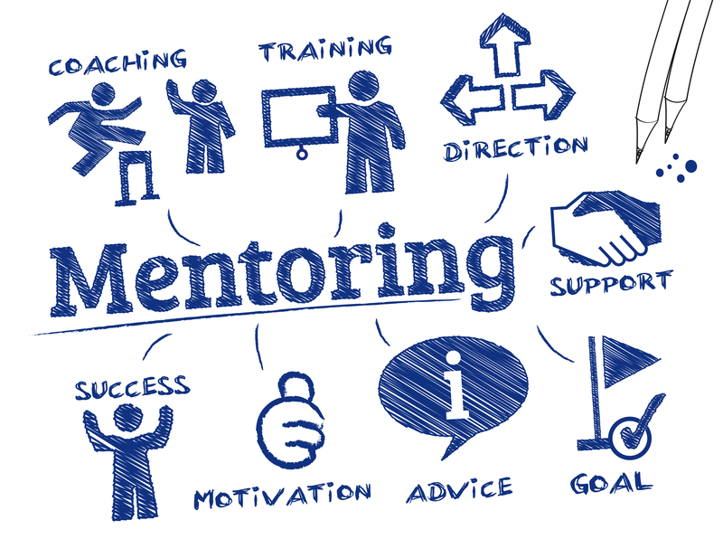
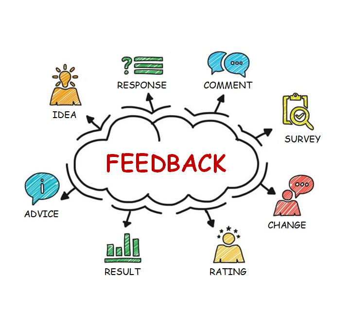

<!-- [Docusaurus blogging features](https://docusaurus.io/docs/blog) are powered by the [blog plugin](https://docusaurus.io/docs/api/plugins/@docusaurus/plugin-content-blog). -->

“How to mentor a junior developer?” This is a question that many senior developers have asked with many years of experience in their careers. Whether you have been assigned as a mentor to a new employee or you are looking for a professional mentor, this article will help you to learn some tips and tricks to properly mentor more junior developers as well as to identify the fundamental traits of a good mentor. Consider this as a roadmap that guides you step by step.

## What is mentoring?

In general, mentoring can be defined as a relationship based on learning and sharing insights between an experienced individual and someone who wishes to progress in their professional life. Mentoring a co-worker requires patience, in-depth understanding of the area and desire to share that expertise.

The person who receives mentoring is known as the mentee while the one who shares their experience is referred to as the mentor. In the tech industry, mentorship often takes place between a senior employee and a junior developer or an intern. The aim of conducting a mentorship program is the junior developer’s growth and career advancement. Usually, the mentor and mentee are internal to the organization, so the mentor can train the mentee to fit into the organizational culture and goals. Effective mentors act as role models for their juniors and provide direction to help them climb the corporate ladder while maintaining a good work-life balance and improving professional skills.

## The importance of mentoring

A great mentorship program consists of guidance, which means teaching the juniors the best practices and scenarios that help them to gain more systematic knowledge about the codebase and its anomalies.

A strong mentorship program benefits both the mentor and mentee. At the end of the program, the mentor can have emotional satisfaction by seeing others succeed under his or her guidance. Also, it supports the mentors to enhance their people management skills, public speaking and the ability to build engaging discussions with their mentees. Mentor will get the opportunity to learn how to explain technical concepts like software architecture, design approach clearly without missing any important details.

A competent mentor can assist the mentee in being more productive at the workplace, learning new technologies, developing the level of confidence and making sound decisions for their professional development.

## Mentoring techniques

### 1. One on one mentoring

The most conventional sort of mentorship is one on one mentoring. This kind of mentoring involves only the mentor and the mentee and it is typically a more knowledgeable person connected with a novice or much junior mentee.

### 2. Group mentoring

In this approach, one or more mentors are working with a bunch of mentees. This strategy is frequently used in organizations where there will not be adequate time and resources to provide one mentee for each employee. Usually, this is a good technique to mentor a group of newly joined interns as they are at the same educational level.

### 3. Peer mentoring

Individuals in this approach are from the same job role, division or they have similar professional experiences. These co-workers form groups or one-on-one relationships to help one another.

### 4. E-mentoring

In today’s context, it is important to keep social distance. In that case, the mentoring programs do not have to be face-to-face. In the E-mentoring approach, participants can communicate remotely by using online tools.

### 5. Reverse mentoring

Reverse mentoring is the inverse of the traditional approach. Instead of a senior developer mentoring a junior developer, the less experienced employee coaches a more senior employee. This technique is typically used for junior professionals to teach a new application or technology to a senior person within the organization.

### 6. Speed mentoring

This type of mentoring is frequently held as a part of a corporate event or conference. The mentee has to go through one-on-one mentoring with multiple mentors and typically move from one mentor to the next after a short conversation. It is the mentee’s responsibility to come prepared with questions for senior-level professionals.

## What makes you a good mentor?

A good mentor-mentee relationship is built on having clear expectations on both sides. For the relationship to be beneficial, a good mentor must be available for their mentee a decent amount of time every day or week. Define how much time you can spend mentoring and inform the mentee what you anticipate from them. If you want them to bring a list of topics to discuss, let them know. If not, you can keep things casual and deal with problems as they arise.

Being a supportive and effective mentor does not mean solving your junior’s problems. It is about supporting them to grow, so they can tackle their problems by themselves. When mentoring, try not to share solutions for each and every challenge they face. It provides them with the freedom to think and find an answer for their own issues.

A good mentor exhibits the following qualities,

### 1. Being a good listener

This is the most significant task that a mentor should perform. The mentor has to be patient and listen carefully to what the mentee has to say. If you are a mentor, you do not need to talk all the time. Instead, listen and provide some advice or insights to your mentee. Start the conversation with questions more often than simply telling them what to do. Ask “How was your day?”, “What are you working on?”, “What are the challenges you are dealing with?” or “What are your weekly targets?”. You should convince your mentee that you are genuinely curious about what you are doing. When the mentors entirely understand their mentees’ concerns, the solutions they provide tend to be more effective. It allows them to share their expertise and guide the junior to successfully manage the situation.

### 2. Provide constructive feedback

A good mentor knows how to convey constructive criticism in a positive manner, so the mentee does not feel discouraged or hopeless. Excellent communication skills are a must to provide actionable feedback and help the mentee avoid making mistakes. Using a friendly and conversational tone helps the junior developers to realize that the feedback is provided to identify the areas that need to be improved, but not to point out their faults. A competent mentor has outstanding communication skills and the ability to customize their approach of communication to the mentee’s personality style.

### 3. Have a wide network of relationships

A great mentor knows how to build connections with other people, not only for themselves but also for their mentees. This is pretty effective if you and your mentee work for the same company. So you can introduce them to other senior people in different divisions who can assist them. Making relationships and inviting others to collaborate with them, even for 2 hours, might help a lot. For instance, if you want to teach your mentee how to prepare a winning resume, you can connect them with a senior person in the human resources division to go through your mentee’s resume and they may provide better insights by looking through a different lens. Even if you and your mentee do not work for the same organizations, there are possibilities to connect them with other well-experienced people in your industry. A good mentor will always have your back and help you succeed in your profession despite who you work for. They will be your precious supporters if you are considering changing your job.

### 4. Enthusiastic

A good mentor is very passionate about their role. They should be confident about their knowledge and maintain a positive mindset all the time. In that way, the mentor can inspire people and help them to succeed. A skilled mentor is truly enjoying and imparting their knowledge with new employees. They are eager to share their experience with newcomers and take their job very seriously.

### 5. Experts in their field

Mentors need to be knowledgeable about the subject matter to be more effective in their role. They should have several years of experience in that particular field because they are going to share their knowledge and expertise of a profession with someone who is just starting their new employment. That does not imply they must know anything and everything, but an amazing mentor will be growth-focused and will research and answer questions that they do not know the answer to. This is extremely helpful for the mentee because the mentor is eager to learn new things alongside them without any hesitation. In other words, a good mentor values ongoing learning and growth in whatever field he/she is working. Someone who feels stuck in their status quo will not make an effective mentor. Good mentors are dedicated and willing to explore and learn new approaches in the industry.

## Things to avoid when mentoring a junior developer

### 1. Don’t ignore the relationship with your mentee

Great communication is the key to a successful mentor-mentee relationship. Trying to disrupt the contact between mentor and mentee can damage the relationship. In some cases, the mentor may have to go on business trips and that affects the mentorship connection with their mentee. But the mentor can propose to stay in touch with the mentee on a frequent basis and provide remote support via other means like Email, Zoom, Microsoft Teams, Slack, etc.

### 2. Admit mismatch early

A mentee needs a foundation to build upon and if the mentor does not have that quality, they are definitely a mismatch. The mismatch is a result of conflicting personalities, different career goals or areas of expertise, variances in work ethics or any other reason. The good thing is, these kinds of mismatches can be detected at an early stage of the mentor-mentee relationship and take necessary actions. But the longer this mismatch remains, it is difficult to rectify. Even though discovering a mismatch is disappointing, it is fairly simple to resolve. If both parties agree to switch, the mentor can collaborate with his or her department and help the mentee to find a more suitable mentor.

### 3. Protect confidentiality

Being a good mentor means creating a safe environment for the mentee to freely express themselves. If you are sharing that information with other people in the company, you obviously violate confidentiality. The moment you become a mentor to your mentee you are bound to establish a safe zone to protect whatever they said in private as confidential information.

### 4. Avoid spoon-feeding the answer

Remember that you are dealing with employees who have different skill sets, strengths and weaknesses. Rather than urging them to accept your ideas, assist them in developing their own unique solutions with a little guidance from your end. Your role as a mentor is to assist and guide the mentee and not to express yourself unnecessarily through control and supervision. Ask questions from them, provide alternatives and avoid telling them what to do.

### 5. Allow to make mistakes

It is natural to make mistakes. Both parties will make mistakes at some point and therefore it is better to handle the situation mindfully and convey that it is not a big deal. Even if it is a small mistake, you both will get stronger by addressing it together.

## Conclusion

In conclusion, keep those points we discussed above in your mind when you are mentoring a junior developer. You and your mentee will be able to learn from each other and find yourself stronger at the end of the program. Also, remember to approach each mentorship program in a unique way because you may have to work with a vast variety of people with different opinions and behaviors. So, one approach may not be very effective for all the mentees.

The value of mentorship cannot be underestimated. If you want to be a mentor, keep on improving your characteristics and know what you should avoid as a mentor. It can be demanding but that does not imply that the opportunity is not worthwhile. Mentors are recognized professionals in an organization who have a great enthusiasm supporting new hires or employees who struggle at work to become successful in their professional life. You are all in it to help and learn from one another as well as to shape the future generation.
